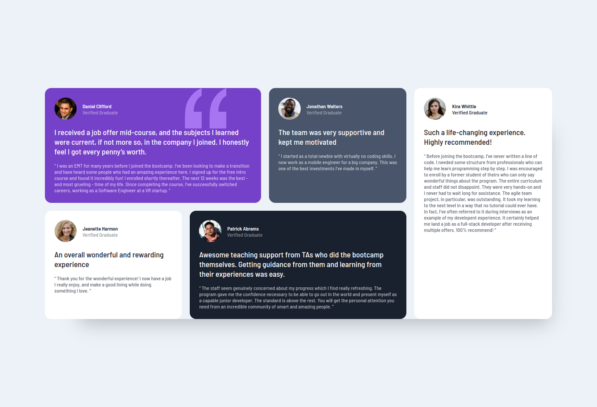

# Frontend Mentor - Testimonials grid section solution

This is a solution to the [Testimonials grid section challenge on Frontend Mentor](https://www.frontendmentor.io/challenges/testimonials-grid-section-Nnw6J7Un7). Frontend Mentor challenges help you improve your coding skills by building realistic projects.

## Table of contents

- [Overview](#overview)
  - [The challenge](#the-challenge)
  - [Screenshot](#screenshot)
  - [Links](#links)
- [My process](#my-process)
  - [Built with](#built-with)
  - [What I learned](#what-i-learned)
  - [Useful resources](#useful-resources)
- [Author](#author)
- [Acknowledgments](#acknowledgments)

**Note: Delete this note and update the table of contents based on what sections you keep.**

## Overview

### The challenge

Users should be able to:

- View the optimal layout for the site depending on their device's screen size

### Screenshot

### Links

- Solution URL: [solution URL here](https://github.com/Valhalla-2/Testimonials-Grid-Section)
- Live Site URL: [live site URL here](https://valhalla-2.github.io/Testimonials-Grid-Section/)

## My process

### Built with

- Semantic HTML5 markup
- CSS custom properties
- Flexbox
- CSS Grid

### What I learned

Learn about CSS grid by doing this challange

### Useful resources

- [Learn CSS Grid the easy way by Kevin Powell](https://youtu.be/rg7Fvvl3taU) - This helped me for understanding basic grid layout. I really liked this video and will use it going forward.
- [No Media Queries! Responsive Layouts Using CSS Grid](https://css-tricks.com/look-ma-no-media-queries-responsive-layouts-using-css-grid/) - This is an amazing article which helped me finally understand the responsive grid without media queries. I'd recommend it to anyone still learning this concept.

## Author

- Frontend Mentor - [@valhalla-2](https://www.frontendmentor.io/profile/Valhalla-2)
- Github - [@valahalla-2](https://github.com/Valhalla-2)

## Acknowledgments

Thanks to [Kevin Powell](https://www.youtube.com/kepowob) & [css tricks](https://css-tricks.com/) I was able to complete the challange .
